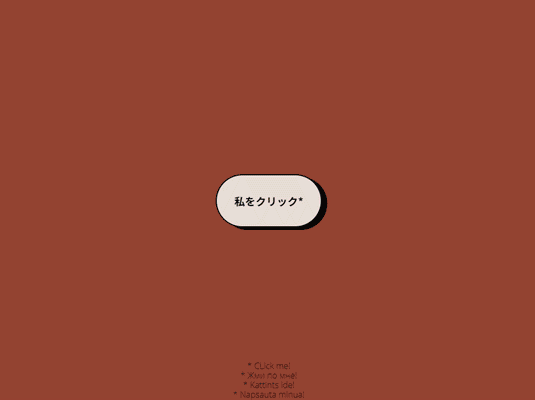

# 💯 JavaScript projects for beginners!

## 🌈 Смена цвета по клику

**Ссылка на проект в gh-pages: [changeColor](https://comediant24.github.io/changeColorBG/)**

## 📖 Задача

В перерывах между спринтами в Я.Практикум продолжаю осваивать JS. В поисках задач наткнулся на [JSBEGINNERS](https://jsbeginners.com/javascript-projects-for-beginners/) и его 100+ задач для начинающих JS.
Для реализации выбрал первый проект по смене цвета страницы по клику пользователя.

## 👨🏻‍💻 JavaScript

Цвета берутся из API `colr.org`. Так как API работае по http протоколу для запуска на `gh-pages` использована переадрисация с `CORS API`.

## 📃 Стек

- HTML, CSS
- Базовый Javascript
- [API colr.org](http://www.colr.org/api.html)
- [CORS API](https://cors-anywhere.herokuapp.com/)
- Методология БЭМ и организация файловой структуры NESTED
- Использование стороннего шрифта
